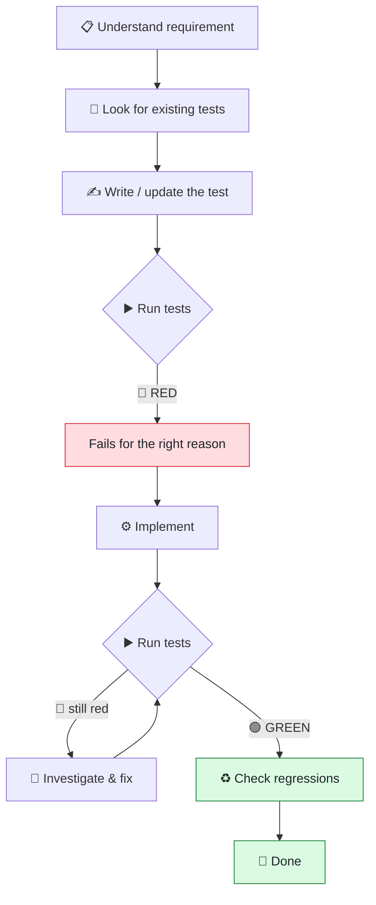
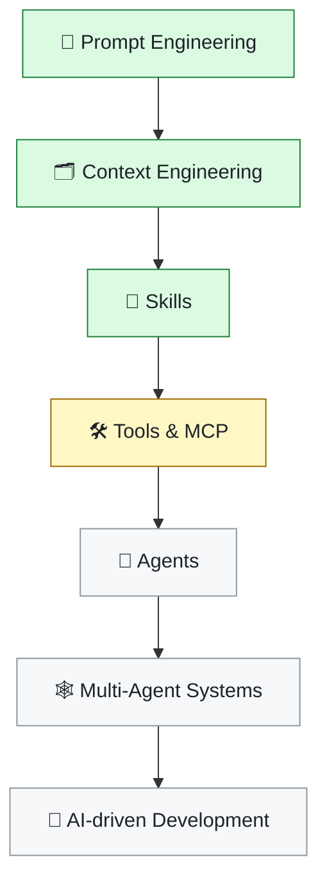

<div align="center">

# 🤖 AI Agentic Development

### *I'm not building an app — I'm building my AI development laboratory.*

A practical playground for learning how AI coding agents actually work,<br/>
and how to give them the right **context**, **instructions**, **tools** and **workflows**.

<br/>


</div>

---

## 🎯 Goal

> **This repository is not trying to ship a production application.**
>
> It is a controlled environment to answer one question:
> *what actually makes an AI coding agent good at engineering work?*

Most people use AI coding tools as a fancy autocomplete. This repo goes the other
way — treating the agent as a **system you engineer**: give it context, give it
process, give it tools, then measure whether the output gets better.

Everything here is small on purpose. The interesting part is never the code —
it's the **scaffolding around the code**.

```
❌ "AI, write my app"          →  unpredictable output, no process
✅ Context + Skills + Agents   →  repeatable engineering workflow
```

---

## 🧠 Concepts explored

| | Concept | What it means here |
|:--:|---|---|
| 🗂️ | **Context Engineering** | Designing what the agent knows before it acts — `CLAUDE.md`, project rules, architecture docs |
| 🧩 | **Skills** | Reusable, versioned instructions that teach the agent *how* to do a kind of work |
| 🤝 | **Agents** | Specialized workers with their own scope, tools and model |
| ⌨️ | **Commands** | Repeatable shortcuts for recurring workflows |
| 🔴🟢 | **Test-Driven Development** | The agent writes the failing test *first* — no "trust me, it works" |
| 🔍 | **Automated Code Review** | A systematic review pass with severity levels, not vibes |
| 🔀 | **Multi-step workflows** | Chaining the above into something that behaves like a real engineering process |

---

## 📁 Structure

```
.
├── .claude/
│   ├── agents/                        # specialized agents        (coming soon)
│   ├── commands/                      # reusable commands         (coming soon)
│   └── skills/
│       ├── test-driven-development/
│       │   └── SKILL.md               # 🔴🟢 the TDD process
│       └── code-review/
│           └── SKILL.md               # 🔍 the review process
│
├── src/
│   └── ai_dev_lab/
│       ├── __init__.py
│       ├── parity.py                  # current example
│       └── project_intelligence/      # MCP server over stdio (Milestone 0)
│           ├── __init__.py
│           ├── __main__.py
│           ├── config.py
│           └── protocol.py
│
├── tests/
│   ├── __init__.py
│   ├── test_parity.py
│   └── project_intelligence/
│       ├── __init__.py
│       ├── test_config.py
│       ├── test_main.py
│       ├── test_protocol.py
│       └── fixtures/fake_project/     # synthetic multi-language target
│
├── docs/
├── CLAUDE.md                          # 🗂️ the agent's project context
└── README.md
```

> 💡 **Why `src/ai_dev_lab/` and not just `src/`?**
> A package literally named `src` is not distributable and collides with every
> other `src` on the path. This was caught by the repo's own Code Review skill —
> see [Code Review in action](#-code-review-in-action).

---

## 🧩 Skills

A **Skill** is a markdown file that teaches the agent a repeatable process.
It is version-controlled, reviewable and improvable — like any other engineering asset.

<table>
<tr>
<th width="50%">🔴🟢 Test-Driven Development</th>
<th width="50%">🔍 Code Review</th>
</tr>
<tr>
<td valign="top">

`.claude/skills/test-driven-development/SKILL.md`

Triggers whenever code is written or changed.

**Rules it enforces**
- Never mark a task done without running tests
- Prefer updating existing tests over adding new ones
- Understand the implementation *before* changing it
- No unnecessary tests

</td>
<td valign="top">

`.claude/skills/code-review/SKILL.md`

Triggers on a diff, PR or change set.

**Rules it enforces**
- Report only issues with concrete evidence
- No personal style preferences
- No inflated severities
- Justify every security claim technically

</td>
</tr>
</table>

### 🔴🟢 The TDD workflow



The critical step is **RED**. A test that passes immediately proves nothing —
it has to fail for the *right reason* first, otherwise you never learn whether
it can detect the bug at all.

### 🔍 The Code Review workflow

```mermaid
flowchart LR
    D["📥 Diff"] --> CTX["🗂️ Context"]
    CTX --> ARCH["🏛️ Architecture"]
    ARCH --> BUG["🐞 Bugs"]
    BUG --> EDGE["🧩 Edge cases"]
    EDGE --> SEC["🔐 Security"]
    SEC --> TST["🧪 Missing tests"]
    TST --> REG["♻️ Regressions"]
    REG --> OUT["📤 Findings by severity"]

    style D fill:#ddf4ff,stroke:#0969da,color:#1f2328
    style OUT fill:#fff8c5,stroke:#9a6700,color:#1f2328
```



Findings are reported with an explicit severity — and the skill forbids inflating them:

| Severity | Meaning |
|---|---|
| 🟣 `CRITICAL` | Security risk, data loss or severe failure |
| 🔴 `HIGH` | Real bug or vulnerability that can reach production |
| 🟠 `MEDIUM` | Relevant problem, limited blast radius |
| 🟡 `LOW` | Minor issue, worth considering |
| ⚪ `INFO` | Observation, no significant impact |

---

## 🛠️ Current example

The first exercise is **intentionally trivial** — the point is the process, not the problem.

A function that determines whether a number is even:

```python
def is_even(number):
    # bool inherits from int: without this guard, True would pass validation
    # and be reported as odd.
    if isinstance(number, bool) or not isinstance(number, int):
        raise TypeError(f"is_even espera int, recebeu {type(number).__name__}")
    return number % 2 == 0
```

<details>
<summary><b>📊 Behaviour contract</b> — click to expand</summary>

<br/>

| Input | Result | Why |
|---|---|---|
| `4` | `True` | even |
| `7` | `False` | odd |
| `0` | `True` | even |
| `-2` | `True` | Python's `%` returns the divisor's sign, so negatives are safe |
| `-3` | `False` | odd |
| `2.5` | `TypeError` | parity is undefined — returning `False` would claim "2.5 is odd" |
| `4.0` | `TypeError` | contract is `int` only, explicitly |
| `True` | `TypeError` | `bool` is a subclass of `int`; silently answering would be a trap |
| `"4"` | `TypeError` | without the guard, `%` is string formatting and the error is misleading |
| `None` | `TypeError` | no parity |

</details>

### 🔍 Code Review in action

The first version of this function was two lines and had **no validation**.
The repo's own Code Review skill was then pointed at it, and produced four findings:

| Severity | Finding | Outcome |
|---|---|---|
| 🟠 `MEDIUM` | Package was literally named `src` — not distributable, breaks once installed | ✅ renamed to `ai_dev_lab` |
| 🟡 `LOW` | `CLAUDE.md` declared Pytest, the suite used `unittest` | ✅ documentation corrected |
| 🟡 `LOW` | `2.5` returned `False`, `True` returned `False` — undefined and untested | ✅ contract enforced + tested |
| ⚪ `INFO` | `is_even("4")` raised a misleading string-formatting error | ✅ fixed by the guard |

**This is the whole thesis of the repo in one table:** the agent reviewed its own
output against a written process and found real problems — not because it was
asked to be critical, but because it had a checklist and evidence rules.

---

## 🧪 Running the tests

From the project root:

```bash
PYTHONPATH=src python3 -m unittest discover -s tests
```

Expected output:

```
......
----------------------------------------------------------------------
Ran 6 tests in 0.000s

OK
```

> ℹ️ `PYTHONPATH=src` is what makes the src-layout resolve without installing the
> package. Once `pyproject.toml` declares the project and it's installed with
> `pip install -e .`, the prefix is no longer needed.

---

## 🔌 Project Intelligence MCP

An MCP server over stdio (JSON-RPC 2.0, one request per line) that points at an
arbitrary `projectRoot` — not necessarily this repository. Milestone 0 proves
the end-to-end wiring: `initialize`, `tools/list` and `tools/call` for a single
tool, `project_info` (file/line counts and known manifests at the target root).

Run it directly, pointed at a target project:

```bash
PYTHONPATH=src python3 -m ai_dev_lab.project_intelligence --root /path/to/target/project
```

Without `--root`, the server uses its own `cwd` as the project root — this is
the mechanism Claude Desktop relies on when it launches the process. Configure
it in `claude_desktop_config.json`:

```json
{
  "mcpServers": {
    "project-intel": {
      "command": "python3",
      "args": ["-m", "ai_dev_lab.project_intelligence"],
      "cwd": "/path/to/target/project",
      "env": { "PYTHONPATH": "/path/to/repo/src" }
    }
  }
}
```

Full architecture, scope and roadmap: `docs/plan-project-intelligence-mcp.md`.

---

## 🔬 Experiments

- [x] Create the first **TDD Skill**
- [x] Create the first **Code Review Skill**
- [x] Have the agent review and fix its own code
- [ ] Create reusable **Claude commands**
- [ ] Create specialized **Agents**
- [ ] Combine Agents and Skills
- [ ] Improve project context (`CLAUDE.md` as a real spec)
- [ ] Experiment with Context Engineering strategies
- [ ] Build multi-step development workflows
- [ ] Explore **MCP** servers and external tools
- [ ] Explore multi-agent workflows

---

## 📚 Learning path



<div align="center">

🟢 done &nbsp;·&nbsp; 🟡 in progress &nbsp;·&nbsp; ⚪ next

</div>

Each concept gets **implemented and tested here**, not just read about.

---

## 🚧 Status

**Work in progress — and permanently so.**

This repository is a lab notebook. The code will stay small; the scaffolding
around it is what grows. Structure, skills and workflows will be rewritten as
better patterns are found — that's the point, not a disclaimer.

---

<div align="center">

## 📄 License

MIT

<br/>


</div>
