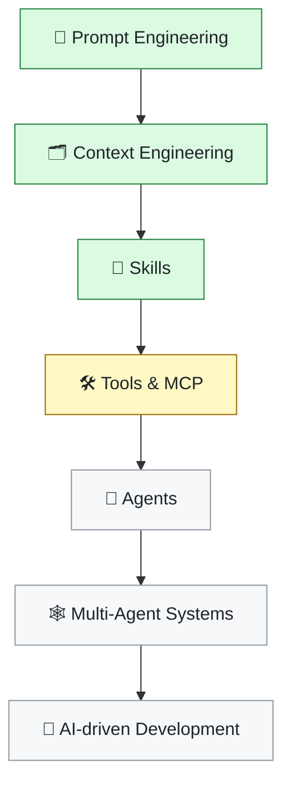

<div align="center">

# 🤖 AI Agentic Development

### *I'm not building an app — I'm building my AI development laboratory.*

A practical playground for learning how AI coding agents actually work,<br/>
and how to give them the right **context**, **instructions**, **tools** and **workflows**.

<br/>


</div>

---

## 🎯 Goal

> **This repository is not trying to ship a production application.**
>
> It is a controlled environment to answer one question:
> *what actually makes an AI coding agent good at engineering work?*

Most people use AI coding tools as a fancy autocomplete. This repo goes the other
way — treating the agent as a **system you engineer**: give it context, give it
process, give it tools, then measure whether the output gets better.

Everything here is small on purpose. The interesting part is never the code —
it's the **scaffolding around the code**.

```
❌ "AI, write my app"          →  unpredictable output, no process
✅ Context + Skills + Agents   →  repeatable engineering workflow
```

---

## 🧠 Concepts explored

| | Concept | What it means here |
|:--:|---|---|
| 🗂️ | **Context Engineering** | Designing what the agent knows before it acts — `CLAUDE.md`, project rules, architecture docs |
| 🧩 | **Skills** | Reusable, versioned instructions that teach the agent *how* to do a kind of work |
| 🤝 | **Agents** | Specialized workers with their own scope, tools and model |
| ⌨️ | **Commands** | Repeatable shortcuts for recurring workflows |
| 🔴🟢 | **Test-Driven Development** | The agent writes the failing test *first* — no "trust me, it works" |
| 🔍 | **Automated Code Review** | A systematic review pass with severity levels, not vibes |
| 🔀 | **Multi-step workflows** | Chaining the above into something that behaves like a real engineering process |

---

## 📁 Structure

```
.
├── .claude/
│   ├── agents/                        # specialized agents        (coming soon)
│   ├── commands/                      # reusable commands         (coming soon)
│   └── skills/
│       ├── test-driven-development/
│       │   └── SKILL.md               # 🔴🟢 the TDD process
│       └── code-review/
│           └── SKILL.md               # 🔍 the review process
│
├── src/
│   └── ai_dev_lab/
│       ├── __init__.py
│       └── project_intelligence/      # MCP server over stdio
│           ├── __init__.py
│           ├── __main__.py            # entrypoint: --root, then serve
│           ├── config.py              # resolves and validates projectRoot
│           ├── errors.py              # ToolError (leaf module, no imports)
│           ├── paths.py               # resolve_within — root containment
│           ├── protocol.py            # JSON-RPC transport only
│           └── exploration.py         # the 5 Exploration-layer tools
│
├── tests/
│   ├── __init__.py
│   └── project_intelligence/
│       ├── __init__.py
│       ├── test_config.py
│       ├── test_main.py
│       ├── test_paths.py
│       ├── test_protocol.py
│       ├── test_exploration.py
│       └── fixtures/fake_project/     # synthetic multi-language target
│
├── docs/
├── CLAUDE.md                          # 🗂️ the agent's project context
└── README.md
```

> 💡 **Why `src/ai_dev_lab/` and not just `src/`?**
> A package literally named `src` is not distributable and collides with every
> other `src` on the path. This was caught by the repo's own Code Review skill —
> see [Code Review in action](#-code-review-in-action).

---

## 🧩 Skills

A **Skill** is a markdown file that teaches the agent a repeatable process.
It is version-controlled, reviewable and improvable — like any other engineering asset.

<table>
<tr>
<th width="50%">🔴🟢 Test-Driven Development</th>
<th width="50%">🔍 Code Review</th>
</tr>
<tr>
<td valign="top">

`.claude/skills/test-driven-development/SKILL.md`

Triggers whenever code is written or changed.

**Rules it enforces**
- Never mark a task done without running tests
- Prefer updating existing tests over adding new ones
- Understand the implementation *before* changing it
- No unnecessary tests

</td>
<td valign="top">

`.claude/skills/code-review/SKILL.md`

Triggers on a diff, PR or change set.

**Rules it enforces**
- Report only issues with concrete evidence
- No personal style preferences
- No inflated severities
- Justify every security claim technically

</td>
</tr>
</table>

### 🔴🟢 The TDD workflow

```mermaid
flowchart TD
    A["📋 Understand requirement"] --> B["🔎 Look for existing tests"]
    B --> C["✍️ Write / update the test"]
    C --> D{"▶️ Run tests"}
    D -->|"🔴 RED"| E["Fails for the right reason"]
    E --> F["⚙️ Implement"]
    F --> G{"▶️ Run tests"}
    G -->|"🔴 still red"| H["🐞 Investigate & fix"]
    H --> G
    G -->|"🟢 GREEN"| I["♻️ Check regressions"]
    I --> J["🏁 Done"]

    style E fill:#ffdce0,stroke:#d1242f,color:#1f2328
    style I fill:#dafbe1,stroke:#1a7f37,color:#1f2328
    style J fill:#dafbe1,stroke:#1a7f37,color:#1f2328
```

The critical step is **RED**. A test that passes immediately proves nothing —
it has to fail for the *right reason* first, otherwise you never learn whether
it can detect the bug at all.

### 🔍 The Code Review workflow


Findings are reported with an explicit severity — and the skill forbids inflating them:

| Severity | Meaning |
|---|---|
| 🟣 `CRITICAL` | Security risk, data loss or severe failure |
| 🔴 `HIGH` | Real bug or vulnerability that can reach production |
| 🟠 `MEDIUM` | Relevant problem, limited blast radius |
| 🟡 `LOW` | Minor issue, worth considering |
| ⚪ `INFO` | Observation, no significant impact |

---

## 🛠️ Current work — Project Intelligence MCP

An MCP server that helps Claude understand **any** software project: read it, map
it, explain it, analyse it, document it. Language-agnostic on purpose — it points
at an arbitrary repository, not at this one.

Milestones 0 through 3 shipped: JSON-RPC 2.0 over stdio, `initialize` /
`tools/list` / `tools/call`, and **eleven tools** — the complete
Exploration, Understanding and Inference layers. Python 3.9, stdlib only.

The design constraint that shapes everything: **no conclusion without evidence.**
Any inferred claim carries the file, the line, the snippet, and a confidence level
tied to the *method* that produced it — not to a feeling:

| `method` | `confidence` |
|---|---|
| `manifest-read`, `ast-parse` | `HIGH` — the evidence **is** the fact |
| `name-pattern` | `MEDIUM` — strong convention, not semantically verified |
| `regex-heuristic` | `LOW` — false positives expected |

The sharpest consequence: `business_rules_analyzer` has **no field for describing
the rule in prose**. It returns candidate locations only. That turns "don't invent
business rules" from a principle in a prompt into a structural impossibility.

Full architecture and roadmap: `docs/plan-project-intelligence-mcp.md`.

### 🔍 Code Review in action

Milestone 0 went through the full `/feature` pipeline. The `reviewer` rejected it,
and every finding below was real — verified on the wire, not just in a test:

| Severity | Finding | Outcome |
|---|---|---|
| 🔴 `BLOQUEANTE` | `tools/call` returned the raw domain dict, missing `content` — required by `CallToolResult`. A real client would get **nothing**: the Python SDK fails validation, the TypeScript SDK hands the model an empty array | ✅ wrapped properly |
| 🟠 `IMPORTANTE` | `os.walk`'s `onerror` killed the whole scan over **one** bad file — a dangling symlink, an unreadable dir, or a file removed by a watcher mid-walk | ✅ degrades and counts instead |
| 🟠 `IMPORTANTE` | `.expanduser()` was dead code after the join, so `--root ~/proj` resolved to `<cwd>/~/proj` | ✅ expands before joining |
| 🟠 `IMPORTANTE` | The fix above introduced a regression: `~nonexistent_user` raised an uncaught `RuntimeError` | ✅ mapped to `ConfigError` |
| ⚪ → 🟠 | Direct indexing of `output_schema` meant one future tool missing the key would wipe the **entire** tool list | ✅ made optional |

**This is the whole thesis of the repo in one table.** Three of those findings are
the same class of error: an assumption about how the client behaves that passes
100% of the automated tests. Two were caught by reviewing against the
specification. A third — Claude Desktop silently dropping the `cwd` key from
`mcpServers` — only surfaced when the server was actually connected to the app.

The rule that came out of it, now written into the plan's `Risks`:
**a test written from an assumption only confirms the assumption.**

---

## 🧪 Running the tests

From the project root:

```bash
PYTHONPATH=src python3 -m unittest discover -s tests
```

Expected output:

```
----------------------------------------------------------------------
Ran 172 tests in 0.366s

OK
```

> ℹ️ `PYTHONPATH=src` is what makes the src-layout resolve without installing the
> package. Once `pyproject.toml` declares the project and it's installed with
> `pip install -e .`, the prefix is no longer needed.

---

## 🔌 Project Intelligence MCP

An MCP server over stdio (JSON-RPC 2.0, one request per line) that points at an
arbitrary `projectRoot` — not necessarily this repository.

| Tool | What it returns |
|---|---|
| `project_info` | counts by extension, total files and lines, known manifests at the root |
| `list_files` | file inventory, `.git/` always ignored, best-effort top-level `.gitignore` |
| `read_file` | text content of one file, confined to the root, size-capped |
| `search_code` | regex hits across text files — file, line number, matching line |
| `project_profile` | consolidated view derived from `project_info` + `list_files` |

And four **Understanding** tools — the first ones that *claim* something, so
every claim carries `evidence` and a `confidence` derived from its `method`:

| Tool | Method | `confidence` |
|---|---|---|
| `project_map` | directory tree — factual, **no** findings | — |
| `architecture_explainer` | `name-pattern` | `MEDIUM`, capped |
| `code_structure_analyzer` | `ast-parse` (Python) / `regex-heuristic` (rest) | `HIGH` / `LOW` |
| `dependency_analyzer` | `manifest-read` / `regex-heuristic` (TOML) | `HIGH` / `LOW` |
| `data_flow_analyzer` | `ast-parse` — a **call graph**, not data flow | `HIGH` |
| `business_rules_analyzer` | `regex-heuristic` — locates candidates, **never describes the rule** | `LOW` |

`findings.py` enforces this in code, not by convention: there is **no
`confidence` parameter** in the API. The only way to emit `HIGH` is to use a
method that parses a well-defined format. A hand-built dict with inflated
confidence is caught by `validate_finding`, and evidence refuses an absolute
path in its constructor.

All three are **pure retrieval** — they return observed fact, with no
`findings`/`confidence` envelope. That envelope starts in Milestone 2, with the
inference tools.

`read_file` is the first tool to open a file whose path comes from the client,
so it carries the project's security surface: absolute paths and symlinks
escaping the root are rejected, `O_NOFOLLOW` closes the TOCTOU window left after
resolution, non-regular files (a FIFO would hang the single-threaded loop) are
refused before any `open()`, and **no error message ever contains an absolute
path** — 13 distinct error paths, each with its own constant message.

Run it directly, pointed at a target project:

```bash
PYTHONPATH=src python3 -m ai_dev_lab.project_intelligence --root /path/to/target/project
```

Configure it in `claude_desktop_config.json`. **`--root` is required here** —
see the note below:

```json
{
  "mcpServers": {
    "project-intel": {
      "command": "python3",
      "args": [
        "-m", "ai_dev_lab.project_intelligence",
        "--root", "/path/to/target/project"
      ],
      "env": { "PYTHONPATH": "/path/to/repo/src" }
    }
  }
}
```

> ⚠️ **Do not use a `cwd` key here.** Claude Desktop does not support `cwd` in
> `mcpServers` — it silently strips the key when it rewrites the config file.
> Without `--root`, the server falls back to the app's own working directory and
> reports a useless inventory (`total_files: 20000`, `scan_truncated: true`) with
> no error explaining why.
>
> Falling back to `cwd` still works when you run the server by hand in a
> terminal, where the working directory is the shell's and therefore predictable.

Restart Claude Desktop with `Cmd+Q` after editing — closing the window is not
enough. The tools then appear under the `+` button in the message composer.

Full architecture, scope and roadmap: `docs/plan-project-intelligence-mcp.md`.

---

## 🔬 Experiments

- [x] Create the first **TDD Skill**
- [x] Create the first **Code Review Skill**
- [x] Have the agent review and fix its own code
- [ ] Create reusable **Claude commands**
- [ ] Create specialized **Agents**
- [ ] Combine Agents and Skills
- [ ] Improve project context (`CLAUDE.md` as a real spec)
- [ ] Experiment with Context Engineering strategies
- [ ] Build multi-step development workflows
- [ ] Explore **MCP** servers and external tools
- [ ] Explore multi-agent workflows

---

## 📚 Learning path



<div align="center">

🟢 done &nbsp;·&nbsp; 🟡 in progress &nbsp;·&nbsp; ⚪ next

</div>

Each concept gets **implemented and tested here**, not just read about.

---

## 🚧 Status

**Work in progress — and permanently so.**

This repository is a lab notebook. The code will stay small; the scaffolding
around it is what grows. Structure, skills and workflows will be rewritten as
better patterns are found — that's the point, not a disclaimer.

---

<div align="center">

## 📄 License

MIT

<br/>


</div>
